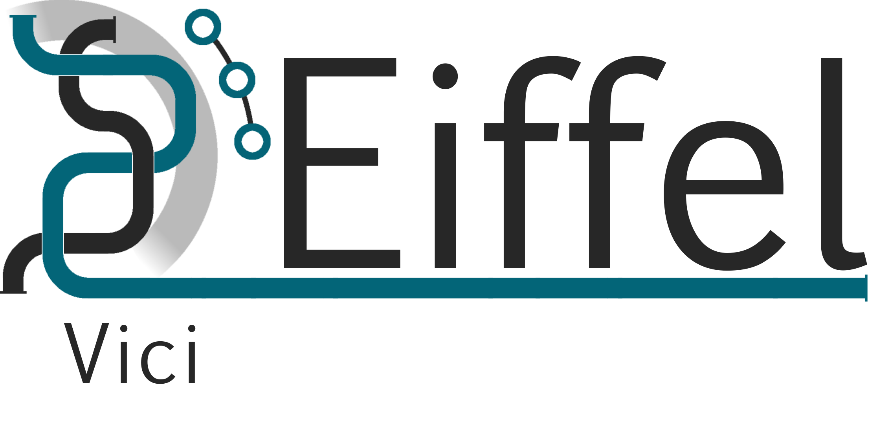

FOR TDDD27 Advanced Web Programming

In this project I will continue working on the webapplication Vici https://github.com/eiffel-community/eiffel-vici
Members is only me Jonathan Wahlund, jonwa732. My Ericsson github acoount name is ewahjon.
Before examination the code at https://github.com/eiffel-community/eiffel-vici will be cloned to https://gitlab.ida.liu.se/jonwa732/TDDD27_2018_Vici

Things that I will do to pass this course is:
- Totally remake the client side using Angular as framework.
- Anything else that the examinatiors may want me to add after reading this (2018-04-01).
- Continuing developing Vici adding features desired by customers and Ericsson, some defined in the Issues.

Right now the project is build with Java Spring Boot as server and my own javascript code in the frontend. The client communicates with the server through Spring restuful API. The server communicates to external databases/eiffel-event-repositories though those specified API.

Usually I work on my own fork https://github.com/ewahjon/eiffel-vici and then combine some commits into a big merge into https://github.com/eiffel-community/eiffel-vici

unzip src/assets/reference-data-set.zip to src/assets/reference-data-set.json\
npm install\
ng build --watch\
start the spring boot server\
may have to restard ng and spring first time

<!---
   Copyright 2017-2018 Ericsson AB.
   For a full list of individual contributors, please see the commit history.

   Licensed under the Apache License, Version 2.0 (the "License");
   you may not use this file except in compliance with the License.
   You may obtain a copy of the License at

       http://www.apache.org/licenses/LICENSE-2.0

   Unless required by applicable law or agreed to in writing, software
   distributed under the License is distributed on an "AS IS" BASIS,
   WITHOUT WARRANTIES OR CONDITIONS OF ANY KIND, either express or implied.
   See the License for the specific language governing permissions and
   limitations under the License.
--->

# Eiffel Vici
Eiffel Vici dynamically visualizes Eiffel events retrieved from an [Eiffel Event Persistence Service](https://eiffel-community.github.io/eiffel-sepia/event-persistence.html). This affords overview and inspection of the software production system in real time, such as it really is, across underlying technologies.

To get started using Vici, see How to Run below.

# About this repository
The contents of this repository are licensed under the [Apache License 2.0](./LICENSE).

To get involved, please see [Code of Conduct](./CODE_OF_CONDUCT.md) and [contribution guidelines](./CONTRIBUTING.md).

# About Eiffel
This repository forms part of the Eiffel Community. Eiffel is a protocol for technology agnostic machine-to-machine communication in continuous integration and delivery pipelines, aimed at securing scalability, flexibility and traceability. Eiffel is based on the concept of decentralized real time messaging, both to drive the continuous integration and delivery system and to document it.

Visit [Eiffel Community](https://eiffel-community.github.io) to get started and get involved.

# How to Run
During the development stage, please consider refreshing the app-webpage with clear cashe if something gets stuck and report the issue.

For the local dummy event repository to work, you have to extract src\main\resources\static\reference-data-set.zip into src\main\resources\static\reference-data-set.json.
This is not required if you intend to use the dummy eiffel-event-repository.

To test your own set of eiffel-events, simply create a .json file that contains a list of eiffel-events and place it in the src\main\resources\static\ directory. When the app is running, go to settings > Manage systems > add a new system with the url localFile[MY_FILE] where you replace MY_FILE with the actual file name (without .json). Example: src\main\resources\static\reference-data-set.json with url localFile[reference-data-set]

To run the app you need Java 8 and Maven installed.

Navigate to the repository root and execute one of the the following commands in the terminal.

~~~~
mvn spring-boot:run
~~~~

or

~~~~
(mvn clean package) -and (java -jar target\vici-eiffel-0.0.1-SNAPSHOT.jar)
~~~~

The Vici app will now run at http://127.0.0.1:8080

## How to docker
To run Vici together with a separate dummy event repository docker container, go to: https://github.com/Ericsson/eiffel-event-repository

- Dockerfile is found at src\main\docker\Dockerfile
- Docker image is created with the fabric8io/docker-maven-plugin with settings found in pom.xml.
- Consider increasing the allowed memory usage for the docker container if the app is getting stuck.

1: To use the local built-in dummy event repository, make sure you have unzipped the reference-data-set.json file like in the "How to Run" section.

2: Build docker image:\
Navigate to the repo root and use the following command: (requires 'mvn clean package')
~~~~
mvn docker:build
~~~~
The docker image should now appear in the list generated by:
~~~~
docker images
~~~~

3: Run docker image on http://127.0.0.1:8080 :  (if you are running docker-machine check IP with : docker-machine ip)
~~~~
mvn docker:run
~~~~
or
~~~~
docker run --rm -p 8080:8080 -t --name vici vici-eiffel
~~~~

The Vici app will now run at http://127.0.0.1:8080 (if you are running docker-machine check IP with : docker-machine ip)
